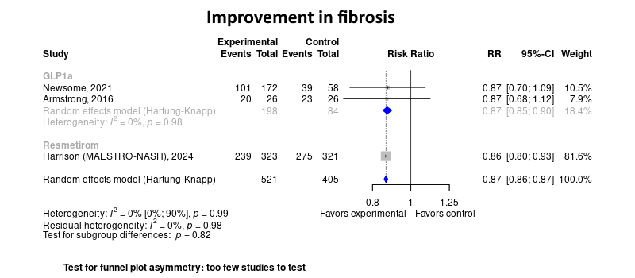

Metabolic dysfunction-associated fatty liver disease (MAFLD) treatment
============================================
A living systematic review

Short url: http://openMetaanalysis.github.io/mafld

**Clinical summary:** This meta-analysis suggests that clinical intervention *is or is not* effective. Heterogeneity of results as measured by I2 was '[moderate](https://training.cochrane.org/handbook/current/chapter-10#section-10-10-2)' at XX%. This review updates previously published meta-analysis(es).(citation[s] below)

<!--
Meta-regression of common modulators (year of publication, study size, event rate in the control groups) finds that the outcome of the intervention is effected by xx.

* [Reconciliation of studies and conclusions with prior meta-analyses](files/reconciliation-tables/Reconciliation%20of%20studies%20and%20conclusions.pdf)
-->
Acknowledgement: we acknowledge the essential work by the authors of the prior [systematic review(s)](#systematic-reviews) listed below.

**Methods overview:** This repository is an [openMetaAnalysis](https://openmetaanalysis.github.io/) that combines methods of scoping, rapid, and living systematic reviews.  This analysis updates one or more previously published review(s) below. A comparison of studies included in this review compared to prior reviews are in the table, [reconciliation of trials included with prior meta-analyses/](files/reconciliation-tables/Reconciliation%20of%20studies.pdf). Newer studies included are listed in the references below. Rationale for newer trials excluded may be listed at the end of the references. 
* [Methods](http://openmetaanalysis.github.io/methods.html) for openMetaAnalysis
* [Evidence search](files/searching/evidence-search.md) for this review (under construction)

**Results:** Details of the studies included are in the:
* [Reconciliation of studies and conclusions with prior meta-analyses](files/reconciliation-tables/Reconciliation%20of%20studies%20and%20conclusions.pdf) (under construction)
* [Description of studies (PICO table)](files/study-details/table-pico.pdf) (under construction)
* [Risk of bias assessment](files/study-details/table-bias.pdf) (under construction)
* [Forest plots](../master/files/forest-plots) ([spreadsheets with source data](files/data))
* [Network plots](../master/files/network) (optional)

The forest plot for the primary outcomes are below. Additional [forest plots](files/forest-plots) of secondary analyses may be available. 

<!--
The meta-regression for the primary outcomes are below. Additional [meta-regressions](files/metaregression) of secondary analyses may be available. 

The GRADE Profile is below. 

-->

References:
----------------------------------

### Systematic review(s)
#### Most recent review at time of last revision of this repository
None

### Randomized controlled trials
#### New trial(s) *not* included in the most recent review above
1. Armstrong MJ, Gaunt P, Aithal GP, Barton D, Hull D, Parker R, Hazlehurst JM, Guo K; LEAN trial team; Abouda G, Aldersley MA, Stocken D, Gough SC, Tomlinson JW, Brown RM, Hübscher SG, Newsome PN. Liraglutide safety and efficacy in patients with non-alcoholic steatohepatitis (LEAN): a multicentre, double-blind, randomised, placebo-controlled phase 2 study. Lancet. 2016 Feb 13;387(10019):679-690. doi: 10.1016/S0140-6736(15)00803-X. Epub 2015 Nov 20. PMID: 26608256.
2. Newsome PN, Buchholtz K, Cusi K, Linder M, Okanoue T, Ratziu V, Sanyal AJ, Sejling AS, Harrison SA; NN9931-4296 Investigators. A Placebo-Controlled Trial of Subcutaneous Semaglutide in Nonalcoholic Steatohepatitis. N Engl J Med. 2021 Mar 25;384(12):1113-1124. doi: 10.1056/NEJMoa2028395. Epub 2020 Nov 13. PMID: 33185364.
3. Loomba R, Abdelmalek MF, Armstrong MJ, Jara M, Kjær MS, Krarup N, Lawitz E, Ratziu V, Sanyal AJ, Schattenberg JM, Newsome PN; NN9931-4492 investigators. Semaglutide 2·4 mg once weekly in patients with non-alcoholic steatohepatitis-related cirrhosis: a randomised, placebo-controlled phase 2 trial. Lancet Gastroenterol Hepatol. 2023 Jun;8(6):511-522. doi: 10.1016/S2468-1253(23)00068-7. Epub 2023 Mar 16. PMID: 36934740; PMCID: PMC10792518.

#### Trial(s) included in the review above
None

#### Trial(s) undergoing review
1. Harrison SA, Bedossa P, Guy CD, Schattenberg JM, Loomba R, Taub R, Labriola D, Moussa SE, Neff GW, Rinella ME, Anstee QM, Abdelmalek MF, Younossi Z, Baum SJ, Francque S, Charlton MR, Newsome PN, Lanthier N, Schiefke I, Mangia A, Pericàs JM, Patil R, Sanyal AJ, Noureddin M, Bansal MB, Alkhouri N, Castera L, Rudraraju M, Ratziu V; MAESTRO-NASH Investigators. A Phase 3, Randomized, Controlled Trial of Resmetirom in NASH with Liver Fibrosis. N Engl J Med. 2024 Feb 8;390(6):497-509. PMID: [38324483](http://pubmed.gov/38324483).

#### Trial(s) excluded - selected list of important trial(s)

#### Cited by
This repository is cited by:

1. WikiDoc contributors. Pending content page. WikiDoc. Nov 9, 2014. Available at: http://www.wikidoc.org/index.php/This_topic. Accessed November 9, 2014. 

-------------------------------
[Cite and use this content](https://github.com/openMetaAnalysis/openMetaAnalysis.github.io/blob/master/reusing.MD)  - [Edit this page](../../edit/master/README.md) - [License](files/LICENSE.md) - [History](../../commits/master/README.md)  - 
[Issues and comments](../../issues?q=is%3Aboth+is%3Aissue)

